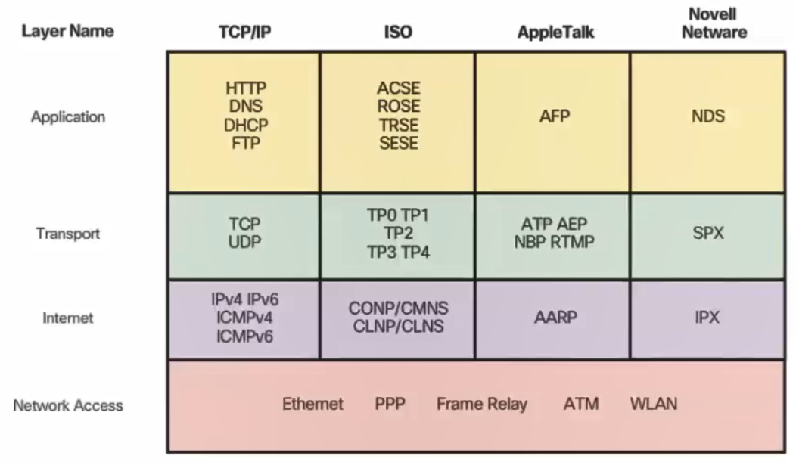
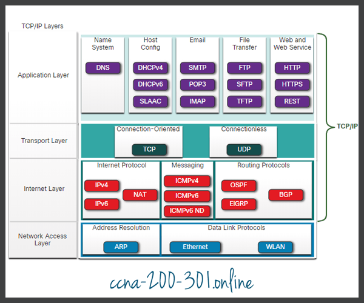
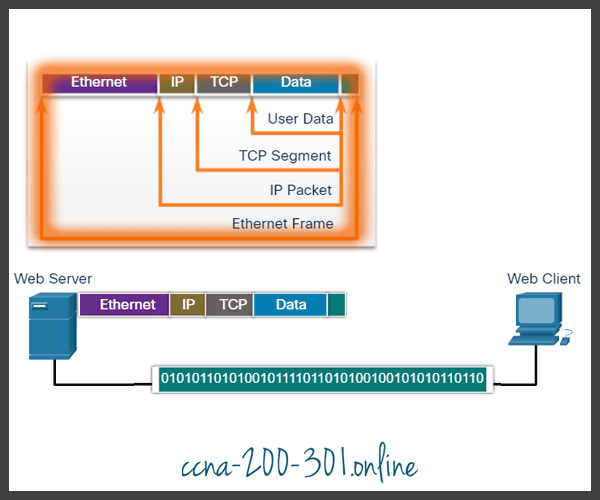
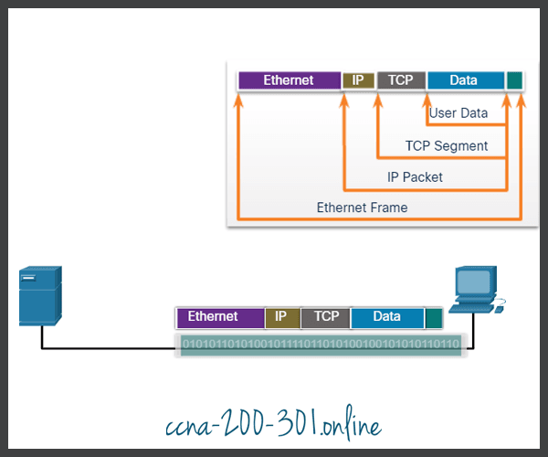

# Network Protocol
Vai trò của giao thức
- Định nghĩa cấu trúc và định dạng của message
- Định nghĩa các tiến trình chia sẻ thông tin với nhau ntn
- Có các cơ chế phát hiện lỗi xảy ra giữa các thiết bị trên mạng
- Thiết lập và khởi tạo phiên kết nối.

Protocol là 1 tập luật, khi thực hiện 1 protocol các trình tự của protocol sẽ được thực hiện lần lượt tùng bước 1 với các thông số đầu vào và đầu ra theo trình tự được lập trình sẵn
# Bộ giao thức - Protocol Suites
Bộ giao thức là tập hợp các giao thức có liên quan đến nhau , có thể tương tác với nhau và làm việc với nhau để xử lý một việc nào đấy.

Ví dụ: khi 2 người giao tiếp:
- Lớp vật lý: Bằng miệng
- Lớp Rules: Quy định bộ giao thức:
  - Cả 2 bên dùng chung ngôn ngữ
  - Chờ đến lượt từng người mới đc nói
  - Đưa ra báo hiệu khi kết thúc thông điệp: nói xong phải kết thúc để đến người khác trả lời chẳng hạn.
  - Mức trên cùng là Content : nội dung của cuộc nói chuyện.

Một số bộ giao thức:

Bộ giao thức phổ biến nhất hiện nay là TCP/IP. Dưới đây là 1 số giao thức điển hình của bộ giao thức TCP/IP.

# Các lớp mô hình OSI
- Aplication: Cung cấp giao diện truy cập trực tiếp với người sử dụng.
- Presentation: Mã hoá, nén dữ liệu và giải mã dữ liệu nhận được
- Sesion: Khởi tạo phiên kết nối, duy trì và kết thúc 1 phiên kết nối.
- Transport(**Cách thức để vận chuyển**, port): Phân đoạn dữ liệu thành các segmentation (nhiều khúc. tại sao vì kích cỡ của dữ liệu ảnh hưởng đến chất lượng của 1 phiên truyền thông ). Sử dụng TCP/UDP để thêm thông tin điều khiển vào các segment.
    - Bắt đầu gửi đi, thế gửi cho ai?
- Network:(**giúp tìm đường**) mỗi segmet được đóng gói thành gói tin (tiến trình này là encapsulation) đưỢc gán tem nhãn đi từ đâu đến đâu. Sử dụng giao thức IP, gói tin này sẽ đc truyền trên mạng nên người ta gọi mạng này là mạng IP là vì thế.
- Datalink: đóng gói tin thành khung (frame) dữ liệu
- Phyciscal: xuống card mạng truyền đi (nó chỉ là tín hiệu điện thôi).

- Mỗi dịch vụ sử dụng các giao thức khác nhau.
- Mô hình osi để tham chiếu thôi, chứ người ta sử dụng mô hình TCP/IP để tối ưu quá trình.

# Protocol Data Units (PDUs)
là đơn vị dữ liệu của giao thức.
là tên gọi của dữ liệu khi đi qua các lớp khác nhau.
Ví dụ: ;ớp 7 là data, lớp 4 là segmets, lớp 3 là packet, lơp2 là frame, lớp 1 là bít.

# Encapsulation (đóng gói dữ liệu) >< De-encapsulation (Mở gói ra)

Quá trình 1 máy chủ đóng gói và gửi 1 trang web đến 1 máy khách:
- Máy chủ đóng gói:

- De-encapsulation:

- **Tại sao phải Encapsulation?**
  - Che nội dung bên trong
  - Vận chuyển chuyển dễ hơn, thời gian vận truyền ngắn: ví dụ như khi gửi thư ta viết rồi gấp thư bỏ vào hộp thư, khi người đưa thư đến phải đọc hết nội dung thư để đọc nd tin (giả sử thông tin ở trong thư) sẽ rất mất thời gian. Vì vậy cần có một tool để người đưa thư nhìn vào 1 cái là biết đc người gửI người nhận.
    - Sau đó gửi đến bưu cục, họ sẽ chon gửi gói tin theo máy bay hay ô tô và phải đóng gói theo format của máy bay hay ô tô để vừa với máy bay hay ô tô chẳng hạn
  - Đấy là lý do phải đóng gói từng lớp từng lớp.
- **Tại sao phải mở theo từng bước?**
  - Khi gửi gói tin từ mtinh A đến B. Nhưng vì lý do nào đó nó gửi đến C, C cố gắng nhận đoạn này nhưng k xử lý đc, nó lãng phí ram và cpu để đọc cái này.
  - Do đó cần mở theo từng bước để đúng đến chức năng của từng thằng.
- Một ví dụ nữa để hiểu hơn về Encapsulation:
  - Trên không gian mạng có rất nhiều switch ,Route truyền gói tin đi
  - Switch nó chỉ mở đến lớp Ethernet , router mở đến IP rồi nó đóng gói lại luôn và gửi đi nhanh nhất có thể.
  - Nếu nó đọc hết nó sẽ phải biết giao thức http như thế nào, và lộ hết nội dung bên trong=> Lâu, không an toàn.

- Địa chỉ IP để tìm từ nguồn tới đích (máy tới máy)
- Đia chỉ Physical sẽ giúp đi từ máy tính tới thiết bị mạng liền kề
- Địa chỉ Layer 2(MAC) thay đổi qua từng thiết bị
## Tầng ứng dụng
## 
- Mã hoá và nén dữ liệu lớP ứng dụng
- Giải mã dữ liệu
## Lớp phiên 

# Tài liệu tham khảo

1. https://ccna-200-301.online/protocol-suites/