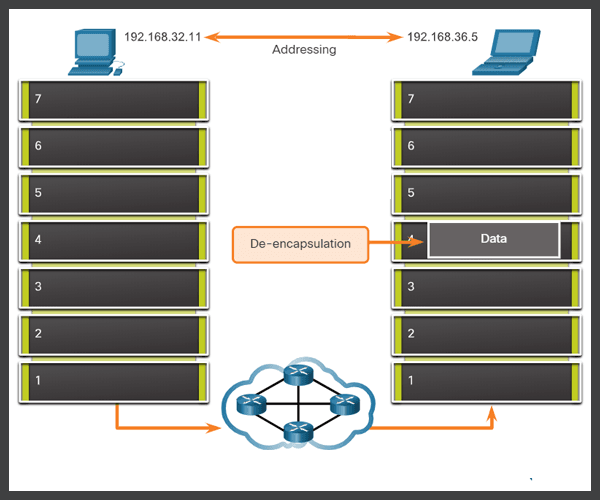
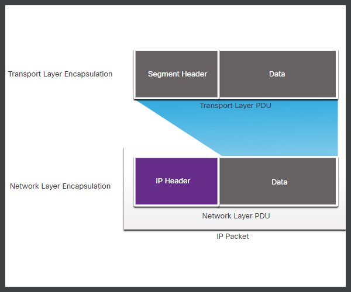
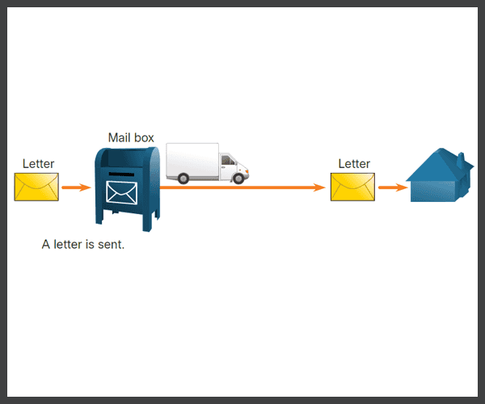
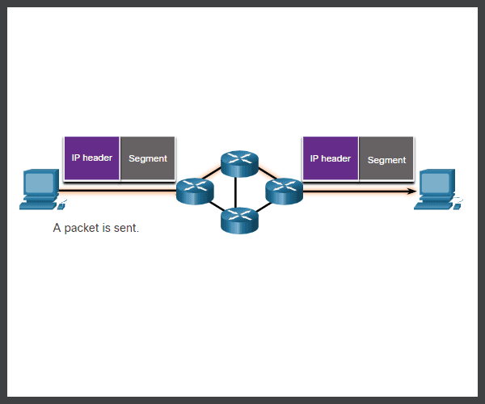
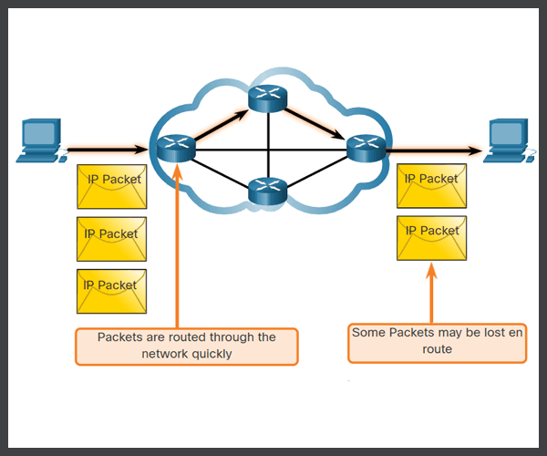
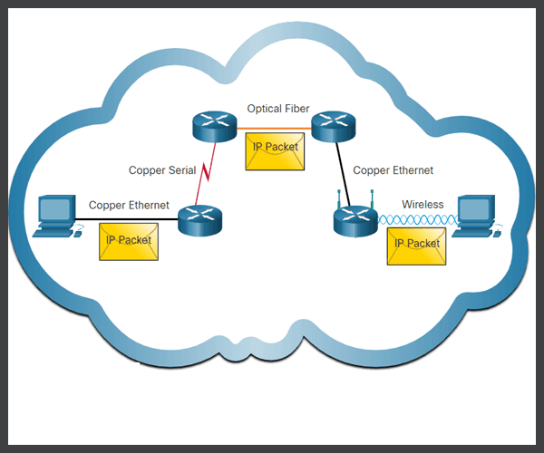

<h1> Network Layer </h1>

<h2> Mục lục </h2>

- [1. Tổng quan](#1-tổng-quan)
  - [2. Network Layer Protocol](#2-network-layer-protocol)
- [3. Cách thức hoạt động của giao thức IP](#3-cách-thức-hoạt-động-của-giao-thức-ip)
- [4. Đặc điểm cơ bản của IP](#4-đặc-điểm-cơ-bản-của-ip)
  - [4.1 Connectionless](#41-connectionless)
  - [4.2 Best Effort](#42-best-effort)
  - [4.3 Media Independent - Không phụ thuộc vào môi trường truyền dẫn](#43-media-independent---không-phụ-thuộc-vào-môi-trường-truyền-dẫn)
- [Tài liệu tham khảo](#tài-liệu-tham-khảo)

# 1. Tổng quan
- Lớp mạng, hay OSI Lớp 3, cung cấp các dịch vụ để cho phép các thiết bị đầu cuối trao đổi dữ liệu giữa các mạng. Cụ thể là cung cấp dịch vụ cho tần phía trên của nó và yêu cầu dịch vụ từ tầng bên dưới.
- Như trong hình, IP phiên bản 4 (IPv4) và IP phiên bản 6 (IPv6) là các giao thức truyền thông tầng mạng nguyên tắc. 

.png)
- Các giao thức lớp mạng khác bao gồm các giao thức định tuyến như Open Shortest Path First (OSPF) và các giao thức nhắn tin như Internet Control Message Protocol (ICMP).

## 2. Network Layer Protocol
Để thực hiện truyền thông end-to-end qua các ranh giới mạng, các giao thức lớp mạng thực hiện bốn hoạt động cơ bản (hay nguyên tắc để để trao đổi dữ liệu cần một số thứ ) như:

- **Đích của thiết bị muốn trao đổi dữ liệu** (Addressing end devices) - *Đi hỏi địa chỉ IP của thiết bị đó.*
- Cần **đóng gói dữ liệu** (Encapsulation) của chúng ta lại lần lượt từ lớp 7 đến lớp 1
- Cần **các giao thức định tuyến** để hỗ trợ chuyển các bản tin, chuyển các dữ liệu đấy từ thiết bị của chúng ta đến thiết bị đích
- Cần **De-encapsulation**, tức là khi mà thiết bị đích nhận được toàn bộ gói tin đấy nó sẽ tìm cách giải mã ngược lại lần lượt từ lớp 1 cho đến lớp 7 

Đấy là 1 số các tiến trình trao đổi dữ liệu giữa các thiết bị máy tính trong không gian mạng.

Quay lại **nhiệm vụ đầu tiên** của nó là cung cấp các dịch vụ cho lớp phía trên của nó (Transport): 
- Theo nguyên tắc thì 3 lớp trên cùng (5,6,7) sẽ sinh ra các **data**.
- Những dữ liệu xuống tầng 4 sẽ tách ra thành các segment và nó sẽ định ra một cái header.
- Sau khi dữ liệu tách thành các segment rồi thì tầng Network sẽ hỗ trợ *forward* những cái segment. Nó đẩy những segment từ cái host từ 192.168.32.11 đến 192.168.36.5:

=>Như vậy nhiệm vụ của nó là cung cấp cách thức để vận chuyển những segment ở tầng số 4 từ host này đến host kia.

**Chức năng, nhiệm vụ thứ 2** là request dịch tầng bên dưới:
- Để có thể forward tức là chuyển các gói segment này từ host 32.11 đến 36.5 ở rất xa thì nó cần yêu cầu dịch vụ từ tầng Data link.
- Tầng datalink sẽ hỗ trợ chuyển các cái frame, tức là hỗ trợ đẩy các packet của tầng network này đi từ thiết bị của mọi người đến cái modem (hay còn gọi là default gateway)
- Tầng 3 là đẩy từ máy nguồn tới máy đích đi qua rất nhiều các lớp mạng khác nhau, rất nhiều các tuyến đường. Tầng 2 là đẩy ở các chặng ngắn. Để đi một đường xa chúng ta phải đi qua từng chặng ngắn một. Thì tầng datalink này sẽ xử lý các việc đấy.
- Tầng physical sẽ hỗ trợ dữ liệu ra khỏi và báo hiệu những tín hiệu nhị phân từ 2 cổng vật lý ở phía đối diện với nhau.

=> Như vậy, tầng 3 hỗ trợ tầng 4 di chuyển và để di chuyển được thì nó gọi các dịch vụ từ tầng 2 lên.

- Tầng 2 để có thể di chuyển từ 1 host sang default gateway ở next hope (hope đối diện) thì cần yêu cầu dịch vụ từ tầng 1.

Ở tầng 3 sẽ có các giao thức tương ứng:
- Internet Protocol Version 4 (IPv4)
- Internet Protocol Version 6 (IPv6)
# 3. Cách thức hoạt động của giao thức IP
IP đóng gói cái segment vào bên trong.

- Đầu tiên là dữ liệu đưỢc được đóng gói thành các segment
- Toàn bộ segment này sẽ được đóng gói vào bên trong một cái IP header vào phía trước. Chúng ta gọi nó là 1 IP packet.
- Dựa vào cái header, những cái packet này có thể được định tuyến xuyên qua một hệ thống mạng phức tạp và gửi đến đích.
- Trong giao thức TCP/IP, người ta gọi PDU (Protocol Data Unit) của tầng network là IP Packet.

# 4. Đặc điểm cơ bản của IP
Nó sẽ có 3 đặc điểm:
- **Connectionless** - có nghĩa là không có hướng kết nối (Không có kết nối với đích trước khi gửi gói dữ liệu)
- Best Effort  - IP vốn không đáng tin cậy vì việc phân phối gói không được đảm bảo.
- Độc lập với phương tiện  - Hoạt động độc lập với phương tiện (tức là đồng, cáp quang hoặc không dây) mang dữ liệu.
## 4.1 Connectionless
IP là không kết nối, có nghĩa là không có kết nối end-to-end chuyên dụng nào được tạo bởi IP trước khi dữ liệu được gửi đi. Giao tiếp không kết nối về mặt khái niệm tương tự như việc gửi một bức thư cho ai đó mà không thông báo trước cho người nhận.

=> Tức là không có hướng kết nối.
**Ví dụ:** Khi ta gửi một bức thư chúng ta ghi người gửi, người nhận và địa chỉ. Chúng ta đặt vào hòm thư

- Bất kể người nhận có tồn tại hay không thì người đưa thư và toàn bộ dịch vụ của bưu điện vẫn sẽ tìm cách chuyển bức thư đó đi.
- Bưu điện không quan tâm việc người nhận nó có tồn tại hay không (giả sử người nhận không tồn tại nó vẫn cứ đẩy cái bức thư này đi.) Có khả năng làm thất lạc bức thư này và không cách nào điều khiển cái này cả. và người nhận được bức thư có thể đọc hiểu được bức thư đó không (Ví dụ viết bằng tiếng nước ngoài) nhưng bức thư vẫn gửI đi bình thường.
- Người nhận sẽ không biết bức thư lúc nào được gửi tới.

=> Những điều này chỉ ra rằng IP là giao thức Connectionless

**Đối chiếu với các giao thức IP** nó cũng sẽ như vậy.

- Các thiết bị gửi sẽ không biết thiết bị nhận có tồn tại hay không.
- Không biết được khi nào bản tin đến được nơi.
- Không biết được liệu thiết bị nhận được có đọc được packet của thiết bị gửi.

## 4.2 Best Effort
Có thể hiểu là đặc điểm của giao thức IP là nó sẽ tìm cách forward bản tin đi càng nhanh càng tốt.
- Best Effort có nghĩa là nỗ lực rất lớn. Có nghĩa là nó cứ đẩy đi thôi, nhận được là nó đẩy đi.

Cho nên người ta miêu tả: **IP là một giao thức lớp mạng không đáng tin cậy, IP không đảm bảo việc tất cả các gói đã gửi sẽ được nhận. Các giao thức khác sẽ quản lý các quá trình để theo dõi các gói tin và đảm bảo quá trình truyền dẫn.**
## 4.3 Media Independent - Không phụ thuộc vào môi trường truyền dẫn

Có nghĩa là cùng 1 gói tin IP có thể được đẩy qua cái mạng cáp đồng hay cáp quang hay một mạng Wireless

Để có thể làm được đặc điểm này là nhờ công của các giao thức tầng 2 (Data link)
- Lớp data link này sẽ hoạt động một cách độc lập và phục vụ cho lớp 3.
- Có thể đẩy qua cáp đồng, cáp quang cũng được mà không phải thay đổi giao thức IP.
- Nếu không có giao thức lớp 2 thì đẩy qua cổng đồng thì giao thức IP phải tương thích với cáp đồng,... Và khi đó giao thức IP nó sẽ rất là phức tạp.

**Ngoài ra**, có một đặc điểm chính của mà lớp mạng xem xét: kích thước tối đa của PDU mà mỗi môi trường có thể vận chuyển. Đặc tính này được gọi là đơn vị truyền cực đại (MTU- maximum transmission unit):
- Lớp liên kết dữ liệu chuyển giá trị MTU đến lớp mạng. 
- Sau đó, lớp mạng sẽ xác định kích thước của các gói.

Trong một số trường hợp, một thiết bị trung gian thường là một bộ định tuyến, phải chia nhỏ gói IPv4 khi chuyển tiếp nó từ phương tiện này sang phương tiện khác bằng MTU nhỏ hơn. Quá trình này được gọi là phân mảnh gói tin, hay phân mảnh. Sự phân mảnh gây ra độ trễ. (Bộ định tuyến không thể phân mảnh gói IPv6).

**Lưu ý:** Những điều cần nhớ
- Chức năng nhiệm vụ của tầng Network
- Các giao thức tầng network
- Cách hoạt động
- Đặc điểm

Bài tiếp theo là: [Tìm hiểu IPv4](./../Day4/IPv4.md)
# Tài liệu tham khảo

1. https://ccna-200-301.online/the-network-layer/