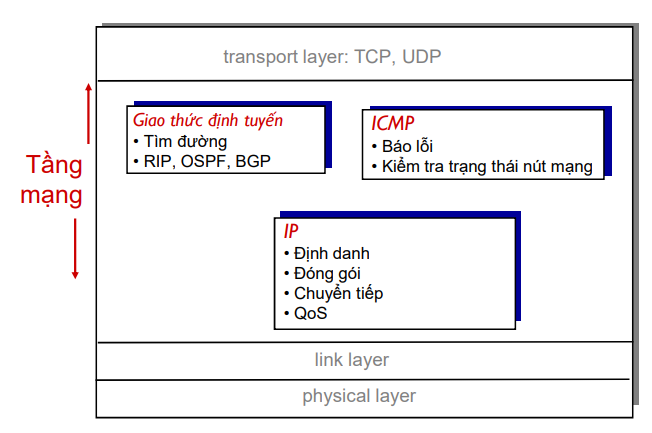

<h1> Network Layer </h1>

<h2> Mục lục </h2>

- [1. Tổng quan](#1-tổng-quan)
- [2. Chức năng](#2-chức-năng)
- [2. Network Layer Protocol](#2-network-layer-protocol)
- [3. Cách thức hoạt động của giao thức IP](#3-cách-thức-hoạt-động-của-giao-thức-ip)
- [4. Đặc điểm cơ bản của IP](#4-đặc-điểm-cơ-bản-của-ip)
  - [4.1 Connectionless](#41-connectionless)
  - [4.2 Best Effort](#42-best-effort)
  - [4.3 Media Independent - Không phụ thuộc vào môi trường truyền dẫn](#43-media-independent---không-phụ-thuộc-vào-môi-trường-truyền-dẫn)
- [5. Định tuyến](#5-định-tuyến)
- [Tài liệu tham khảo](#tài-liệu-tham-khảo)

# 1. Tổng quan
- Lớp Network, hay lớp mạng thuộc tầng 3 trong 7 tầng mô hình OSI.
- Tầng này chịu trách nhiệm đáp ứng các yêu cầu dịch vụ từ tầng giao vận và đưa ra những yêu cầu dịch vụ đối với tầng liên kết dữ liệu.
.png)
# 2. Chức năng
Để thực hiện truyền thông end-to-end qua các ranh giới mạng, các giao thức lớp mạng thực hiện bốn hoạt động cơ bản (hay nguyên tắc để để trao đổi dữ liệu cần một số thứ ) như:

- Định tuyến (Routing): Tìm tuyến đường (qua các nút trung gian) để gửi dữ liệu từ nguồn tới đích
- Xác định đường đi ngắn nhất giữa 2 bên truyền tin
- Chuyển tiếp (Forwarding): Chuyển gói tin vào từ đầu vào và ra 1 đầu thích hợp trên Router 
- Định địa chỉ (Addressing): Định danh địa chỉ cho các nút mạng
- Đóng gói dữ liệu (Encapsulation): Nhận dữ liệu từ giao thức tầng trên, thêm IP Header vào quá trình truyền từ nguồn tới đích.
- Đảm bảo chất lượng dịch vụ(QoS): Đảm bảo các thông số phù hợp của đường truyền theo từng dịch vụ

Đấy là 1 số các tiến trình trao đổi dữ liệu giữa các thiết bị máy tính trong không gian mạng.

Quay lại **nhiệm vụ đầu tiên** của nó là cung cấp các dịch vụ cho lớp phía trên của nó (Transport): 
- Những dữ liệu xuống tầng 4 sẽ tách ra thành các segment và nó sẽ định ra một cái header.
- Sau khi dữ liệu tách thành các segment rồi thì tầng Network sẽ hỗ trợ *forward* những cái segment. Nó đẩy những segment từ cái host từ 192.168.32.11 đến 192.168.36.5:

=>Như vậy nhiệm vụ của nó là cung cấp cách thức để vận chuyển những segment ở tầng số 4 từ host này đến host kia.

**Chức năng, nhiệm vụ thứ 2** là request dịch tầng bên dưới:
- Để có thể forward tức là chuyển các gói segment này từ host 32.11 đến 36.5 ở rất xa thì nó cần yêu cầu dịch vụ từ tầng Data link.
- Tầng datalink sẽ hỗ trợ chuyển các cái frame, tức là hỗ trợ đẩy các packet của tầng network này đi từ thiết bị của mọi người đến cái modem (hay còn gọi là default gateway)
- Tầng 3 là đẩy từ máy nguồn tới máy đích đi qua rất nhiều các lớp mạng khác nhau, rất nhiều các tuyến đường. Tầng 2 là đẩy ở các chặng ngắn. Để đi một đường xa chúng ta phải đi qua từng chặng ngắn một. Thì tầng datalink này sẽ xử lý các việc đấy.
- Tầng physical sẽ hỗ trợ dữ liệu ra khỏi và báo hiệu những tín hiệu nhị phân từ 2 cổng vật lý ở phía đối diện với nhau.

=> Như vậy, tầng 3 hỗ trợ tầng 4 di chuyển và để di chuyển được thì nó gọi các dịch vụ từ tầng 2 lên.

- Tầng 2 để có thể di chuyển từ 1 host sang default gateway ở next hope (hope đối diện) thì cần yêu cầu dịch vụ từ tầng 1.
# 2. Network Layer Protocol

Ở tầng 3 sẽ có các giao thức tương ứng:
- Internet Protocol Version 4 (IPv4)
- Internet Protocol Version 6 (IPv6)

- Các giao thức khác bao gồm:
  -  Các giao thức định tuyến như Open Shortest Path First (OSPF), Routing Information Protocol (RIP),...
  -  Giao thức báo lỗi như Internet Control Message Protocol (ICMP).
# 3. Cách thức hoạt động của giao thức IP
IP đóng gói cái segment vào bên trong IP Packet (PDU - Protocol Data Unit) của tầng network. Và gắn thêm trường IP Header.

- Đầu tiên là dữ liệu đưỢc được đóng gói thành các segment tầng Transport.
- Toàn bộ segment này sẽ được gắn thêm trường IP Header và đóng gọi lại thành 1 packet.
- Dựa vào IP header, những cái packet này có thể được định tuyến xuyên qua một hệ thống mạng phức tạp và gửi đến đích.
- Trong giao thức TCP/IP, người ta gọi PDU (Protocol Data Unit) của tầng network là IP Packet.

# 4. Đặc điểm cơ bản của IP
Nó sẽ có 3 đặc điểm:
- **Connectionless** - có nghĩa là không có hướng kết nối (Không có kết nối với đích trước khi gửi gói dữ liệu)
- **Best Effort**  - Không tin cậy/nhanh
- **Không phụ thuộc vào môi trường truyền dẫn** - Hoạt động độc lập với phương tiện (tức là đồng, cáp quang hoặc không dây) mang dữ liệu.
## 4.1 Connectionless
IP là không kết nối, có nghĩa là không có kết nối end-to-end chuyên dụng nào được tạo bởi IP trước khi dữ liệu được gửi đi. Giao tiếp không kết nối về mặt khái niệm tương tự như việc gửi một bức thư cho ai đó mà không thông báo trước cho người nhận.

=> Tức là không có hướng kết nối.
**Ví dụ:** Khi ta gửi một bức thư chúng ta ghi người gửi, người nhận và địa chỉ. Chúng ta đặt vào hòm thư

- Bất kể người nhận có tồn tại hay không thì người đưa thư và toàn bộ dịch vụ của bưu điện vẫn sẽ tìm cách chuyển bức thư đó đi.
- Bưu điện không quan tâm việc người nhận nó có tồn tại hay không (giả sử người nhận không tồn tại nó vẫn cứ đẩy cái bức thư này đi.) Có khả năng làm thất lạc bức thư này và không cách nào điều khiển cái này cả. và người nhận được bức thư có thể đọc hiểu được bức thư đó không (Ví dụ viết bằng tiếng nước ngoài) nhưng bức thư vẫn gửI đi bình thường.
- Người nhận sẽ không biết bức thư lúc nào được gửi tới.

=> Những điều này chỉ ra rằng IP là giao thức Connectionless

**Đối chiếu với các giao thức IP** nó cũng sẽ như vậy.

- Các thiết bị gửi sẽ không biết thiết bị nhận có tồn tại hay không.
- Không biết được khi nào bản tin đến được nơi.
- Không biết được liệu thiết bị nhận được có đọc được packet của thiết bị gửi.

## 4.2 Best Effort
- Best Effort có nghĩa là nỗ lực rất lớn - có thể hiểu là nó sẽ tìm cách forward bản tin đi càng nhanh càng tốt, cứ nhận được là nó đẩy đi
- Không tin cậy: không có cơ chế phục hồi nếu có lỗi.

- Cần có sự hỗ trợ của dịch vụ tầng transport để đảm bảo độ tin cậy (TCP).
## 4.3 Media Independent - Không phụ thuộc vào môi trường truyền dẫn

Có nghĩa là cùng 1 gói tin IP có thể được đẩy qua cái mạng cáp đồng hay cáp quang hay một mạng Wireless mà không phải thay đổi giao thức

**Ngoài ra**, có một đặc điểm chính của mà lớp mạng xem xét: kích thước tối đa của PDU mà mỗi môi trường có thể vận chuyển. Đặc tính này được gọi là đơn vị truyền cực đại (MTU- maximum transmission unit):
- Lớp liên kết dữ liệu chuyển giá trị MTU đến lớp mạng. 
- Sau đó, lớp mạng sẽ xác định kích thước của các gói.

Trong một số trường hợp, một thiết bị trung gian thường là một bộ định tuyến, phải chia nhỏ gói IPv4 khi chuyển tiếp nó từ phương tiện này sang phương tiện khác bằng MTU nhỏ hơn. Quá trình này được gọi là phân mảnh gói tin, hay phân mảnh. Sự phân mảnh gây ra độ trễ. (Bộ định tuyến không thể phân mảnh gói IPv6).

# 5. Định tuyến 
**Lưu ý:** Những điều cần nhớ
- Chức năng nhiệm vụ của tầng Network
- Các giao thức tầng network
- Cách hoạt động
- Đặc điểm

Bài tiếp theo là: [Tìm hiểu IPv4](./../Day4/IPv4.md)
# Tài liệu tham khảo

1. https://ccna-200-301.online/the-network-layer/
2. https://users.soict.hust.edu.vn/tungbt/it3080/Chap4.pdf
3. https://eclass.teicrete.gr/modules/document/file.php/TP326/%CE%98%CE%B5%CF%89%CF%81%CE%AF%CE%B1%20(Lectures)/Computer_Networking_A_Top-Down_Approach.pdf