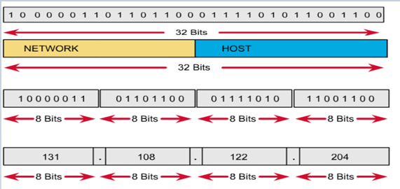
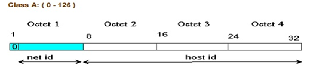

<h1> Tìm hiểu địa chỉ IPv4 </h1>

<h2> Mục lục </h2>

- [1. Tổng quan](#1-tổng-quan)
- [2. Các loại địa chỉ IP](#2-các-loại-địa-chỉ-ip)
  - [2.1 IP Public](#21-ip-public)
  - [2.2 IP Private](#22-ip-private)
  - [2.3 IP Static](#23-ip-static)
  - [2.4 IP Dynamic](#24-ip-dynamic)
- [3. Cấu trúc địa chỉ IPv4](#3-cấu-trúc-địa-chỉ-ipv4)
  - [3.1 Biểu diễn địa chỉ IPv4](#31-biểu-diễn-địa-chỉ-ipv4)
  - [3.2 Quy tắc đặt IPv4](#32-quy-tắc-đặt-ipv4)
- [4. Các lớp địa chỉ](#4-các-lớp-địa-chỉ)
  - [4.1 Lớp A](#41-lớp-a)
  - [4.2 Lớp B](#42-lớp-b)
  - [4.3 Lớp C](#43-lớp-c)
  - [4.4 Lớp D](#44-lớp-d)
  - [4.5 Lớp E](#45-lớp-e)
- [5. Địa chỉ Broadcast](#5-địa-chỉ-broadcast)
- [6. Default route](#6-default-route)
- [7. Địa chỉ Lookback](#7-địa-chỉ-lookback)
- [Tài liệu tham khảo](#tài-liệu-tham-khảo)

# 1. Tổng quan
- Địa chỉ Internet Protocol (Viết tắt là IP - giao thức Internet) là số định dạng cho một phần cứng mạng, các thiết bị sử dụng địa chỉ IP để liên lạc với nhau qua mạng dựa trên IP như mạng Internet.
- Địa chỉ IP cung cấp nhận dạng cho một thiết bị mạng, tương tự như địa chỉ nhà riêng hoặc doanh nghiệp. Các thiết bị trên mạng có các địa chỉ IP khác nhau.
- Giao thức Internet phiên bản 4 (IPv4 - Internet Protocol version 4) là phiên bản thứ tư trong quá trình phát triển của các giao thức Internet (IP). Đây là phiên bản đầu tiên của IP được sử dụng rộng rãi.

# 2. Các loại địa chỉ IP
Tuỳ vào mục đích sử dụng mà địa chỉ IP được phân làm:
## 2.1 IP Public
- Là địa chỉ IP sử dụng cho các gói tin đi trên môi trường Internet.
- Được định tuyến trên môi trường Internet.
- Không sử dụng trong mạng LAN
- Phải là duy nhất cho mỗi host tham gia vào internet
## 2.2 IP Private
- Chỉ được sử dụng trong mạng LAN
- Không được định tuyến trên môi trường Internet
- Có thể sử dụng lặp lại trong các mạng LAN khác nhau.
- ý nghĩa: Bảo tồn địa chỉ IP Public đang dần cạn kiệt.
## 2.3 IP Static
- còn gọi là IP tĩnh
- Địa chỉ được cấu hình thủ công
- Không bị thay đổi theo thời gian

## 2.4 IP Dynamic
- Còn gọi là IP động, đồng nghĩa là địa chỉ ip có thể thay đổi được
- Địa chỉ được cấu hình tự động, được quản lý qua DHCP server.
# 3. Cấu trúc địa chỉ IPv4
## 3.1 Biểu diễn địa chỉ IPv4
- Địa chỉ IPv4 là một dãy nhị phân dài 32 bit, được
  - Được hiển thị dưới dạng thập phân
  - Chia thành 4 cụm (còn gọi là octet), mỗi cụm 8bit
  - Mỗi octet cách nhau bởi dấu chấm `.`

Địa chỉ IP được chia thành hai phần: 
- Network ID - địa chỉ mạng là địa chỉ được cấp cho từng mạng riêng.
- Host ID (hay Host Address) là địa chỉ của máy trong mạng.

## 3.2 Quy tắc đặt IPv4
- Các bit phần mạng không được phép đồng thời bằng 0.
  - Ví dụ: Địa chỉ 0.0.0.1/24 với phần mạng là 0.0.0 và phần host là 1 là không hợp lệ.
- Nếu các bit phần host đồng thời bằng 0, ta có một địa chỉ mạng.
    - Ví dụ: Địa chỉ 192.168.7.1 là một địa chỉ có thể gán cho host nhưng địa chỉ 192.168.7.0 là một địa chỉ mạng, không thể gán cho host được.
- Nếu các bit phần host đồng thời bằng 1, ta có một địa chỉ broadcast.
Ví dụ: Địa chỉ 192.168.7.255 là địa chỉ broadcast cho mạng 192.168.7.0

# 4. Các lớp địa chỉ

## 4.1 Lớp A

- Phần Mạng: 1 octet đầu, 3 octet sau là phần host
- Bit đầu của một địa chỉ lớp A luôn là `0`.
- Dải mạng từ: 1.0.0.0 -> 126.0.0.0.
- Mạng 127.0.0.0 được sử dụng làm mạng loopback.
- Phần host có 24 bit, mạng lớp A có 2^24-2 host

## 4.2 Lớp B

- Sử dụng 2 octet đầu-  phần mạng, 2 octet sau - phần host.
- Hai bit đầu của một địa chỉ lớp B luôn được giữ là 10.
- Gồm: 128.0.0.0 -> 191.255.0.0. 
- Lớp B có 2^16-2 Host
## 4.3 Lớp C

- Sử dụng 3 octet đầu - phần mạng, 1 octet sau - phần host.
- Ba bit đầu của một địa chỉ lớp C luôn được giữ là 110.
- Gồm: 192.0.0.0 -> 223.255.255.0
- Lớp C có 2^8-2 Host
## 4.4 Lớp D

- Gồm các địa chỉ thuộc dải: 224.0.0.0 -> 239.255.255.255
- Được sử dụng làm địa chỉ multicast.
Ví dụ: 224.0.0.5 dùng cho OSPF; 224.0.0.9 dùng cho RIPv2

## 4.5 Lớp E
- Từ 240.0.0.0 trở đi.
- Được dùng cho mục đích dự phòng.

# 5. Địa chỉ Broadcast
- Địa chỉ Broadcast là địa chỉ có toàn bộ các bit phần Host-id là bit 1.
- Là địa chỉ đại diện cho toàn bộ các thiết bị kết nối trong cùng mạng
- Không được đặt cho thiết bị nào
- Một gói tin gửi đến Broadcast, toàn bộ thiết bị trong mạng đều nhận được.

# 6. Default route
- là địa chỉ định danh cho một mạng con (LAN, subnet)
- Là địa chỉ đầu tiên trong dải địa chỉ của subnet.
- Không thể gắn cho 1 host cụ thể
- Ví dụ: Dải địa chỉ 192.168.1.0/24 đến 192.168.1.255/24 có địa chỉ Default route là 192.168.1.0

# 7. Địa chỉ Lookback
- Dải địa chỉ : 127.0.0.0/8
- quy định dành riêng cho thiết bị thực hiện các giao tiếp bên trong chính nó

# Tài liệu tham khảo

1. https://vi.wikipedia.org/wiki/IPv4
2. https://vnpro.vn/thu-vien/chuong-1-dia-chi-ipv4-chia-subnet-vlsm-summary-4108.html