# Cấu trúc gói tin IPv4

- [Cấu trúc gói tin IPv4](#cấu-trúc-gói-tin-ipv4)
  - [1. Note](#1-note)
  - [2. Example](#2-example)
- [Tài liệu tham khảo](#tài-liệu-tham-khảo)

## 1. Note

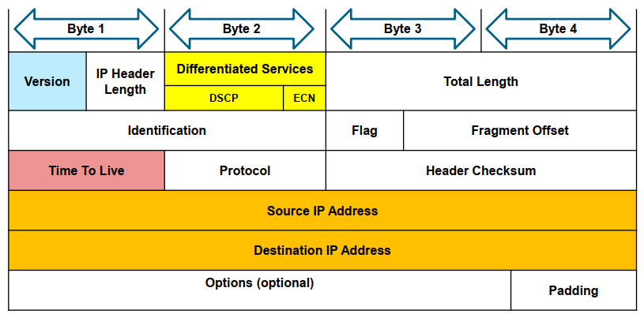

**Version :**

- dài 4 bit
- Mô tả phiên bản của IP.
- Có giá trị là 0100

**IP Header Length:** 

- Độ dài 4 bit
- Xác định độ dài của trường IP Header

**Differentiated Services or DiffServ (DS):**

-  Trước đây được gọi là trường loại dịch vụ (ToS - Type Of Service).
-  Dài 8 bit
-  Sử dụng để xác định mức độ ưu tiên của mỗi gói (packet). 
-  Gồm
   -  6 bit đầu là trường Differentiated Services Code Point (DSCP) (DSCP).
   -  2 bit cuối cùng là các bit Explicit Congestion Notification (ECN).

**Total Length:** Tổng độ dài của gói tin IPv4 (cả phần IP Header và Data).

**Header Checksum :** được sử dụng để phát hiện lỗi tiêu đề

**Time to Live (TTL):**

- Dài 8 bit
- Sử dụng để giới hạn thời gian tồn tại của gói tin.
- Thiết bị nguồn của gói IPv4 đặt giá trị TTL ban đầu. 
- Giá trị này giảm đi 1 lần mỗi khi gói được xử lý bởi router. Nếu TTL giảm xuống 0, Router sẽ loại bỏ gói tin và gửi gói tin Internet Control Message Protocol (ICMP) thông báo quá thời gian tới Địa chỉ nguồn.

**Protocol:**

- Có độ dài 8 bit
- Sử dụng để xác định giao thức được sử dụng trong phần dữ liệu của gói IPv4
- Cho phép lớp mạng chuyển dữ liệu đến giao thức lớp trên thích hợp.
- Ví dụ : TCP (6), UDP (17),...

**Source IPv4 Address:**

- Dài 32 bit
- Đại diện cho địa chỉ IP nguồn của Packet.
- Luôn luôn là địa chỉ Unicast

**Destination IPv4 Address:**
- Dài 32 bit
- Đại diện cho địa chỉ IP đích của Packet, xác định nơi gói tin đến.
- Có thể là: địa chỉ Unicast, multicast hoặc broadcast.

**Các trường để sắp xếp lại gói tin bị phân mảnh:**
- Identification: 
  - ID của gói tin
  - kích thước 16 bit
  - Được chọn bởi nguồn gửi của packet.
  - Nếu bị phân mảnh thì giá trị này để nút có thể nhóm lại các mảnh để phục hồi gói tin
- Flags
- Fragment Offset

**Các trường hiếm khi được sử dụng:**
- Options
- Padding

## 2. Example

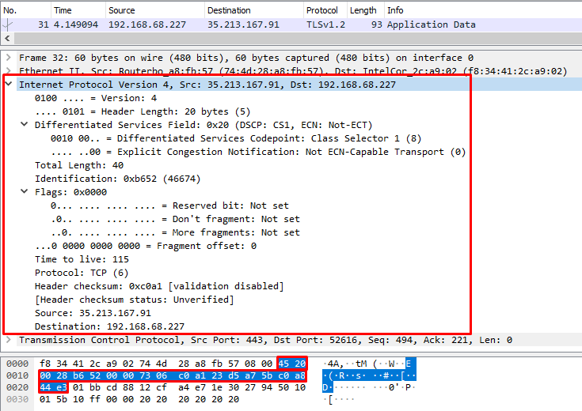

- Version: 4 (0100)
- Header Length: 20 bytes (5)

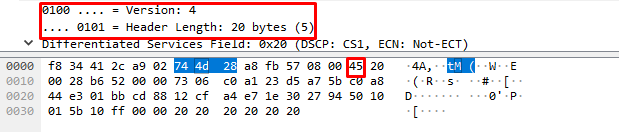

- DS: 0x20

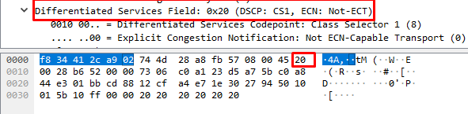

- Total Length:40 bytes

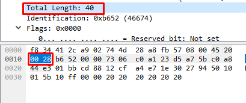

- Identification: 0xb652

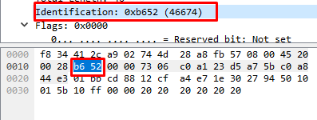

- Flags: 0x0000

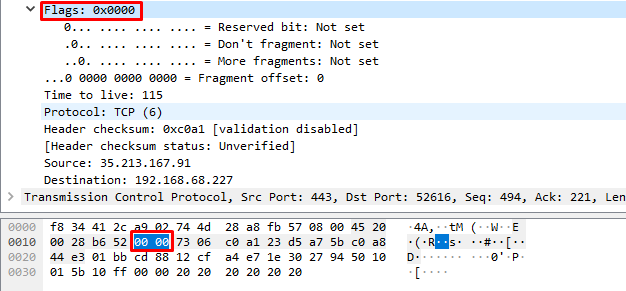

- Time to live: 115

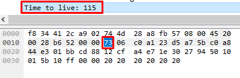

- Protocol: TCP (6)

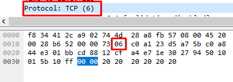

- Header checksum: 0xc0a1

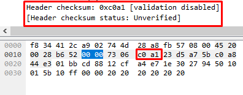

- Source:

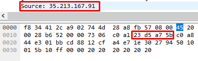

- Destination:

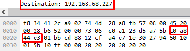

# Tài liệu tham khảo

1. https://ccna-200-301.online/ipv4-packet/
2. https://vnpro.vn/thu-vien/ipv4-address-representation-4057.html
3. https://vi.wikipedia.org/wiki/IPv4